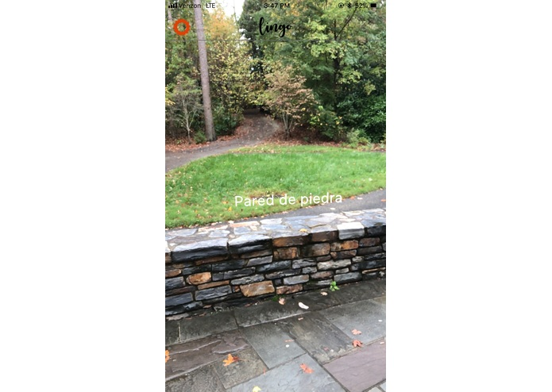
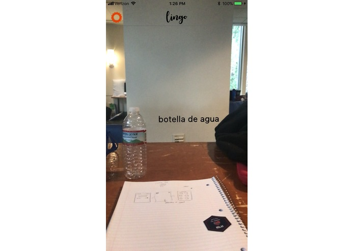
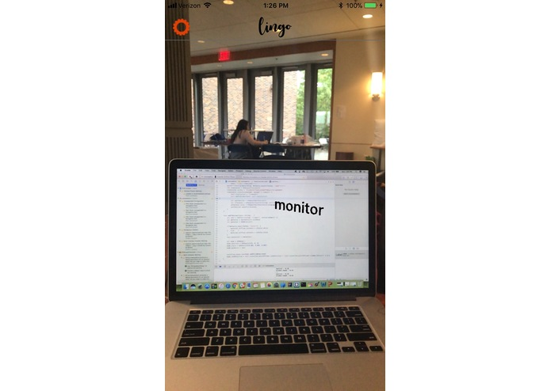

# Lingo
Lingo aims to educate lingual learners by immersing them in new languages through the objects right in front of them. Lingo was made during the 24-hour HackDuke 2017. Here's the link to the devpost: https://devpost.com/software/lingo-wnr4yz

*Members:* Chandler Griffin, Gianne Flores

## Functionality

The app uses the MobileNet Core ML model and the Google Translate API to analyze the objects in front of you, translate them both in text and speech, and display the translation back on the screen.

Here's some examples:

